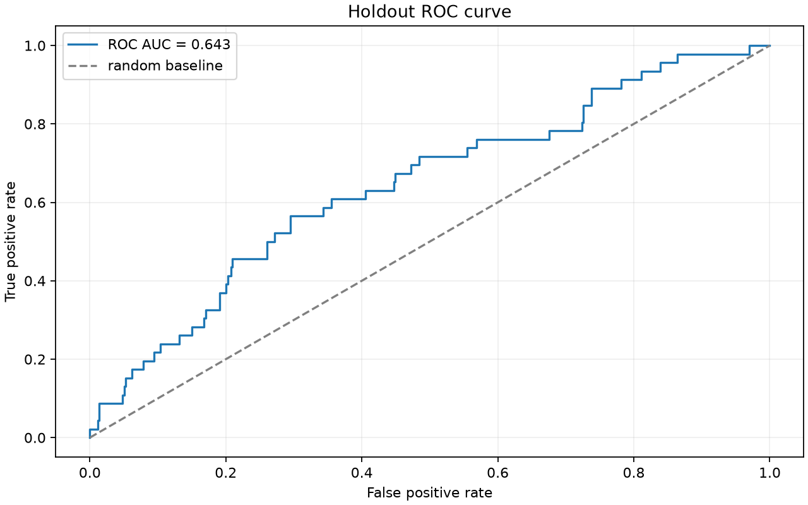
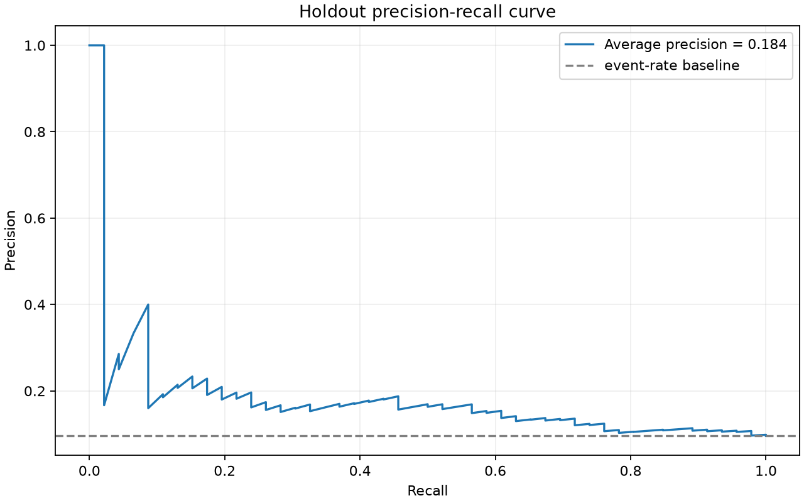
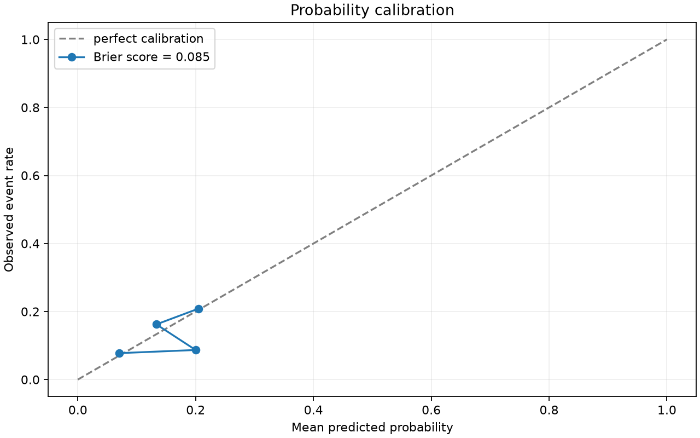
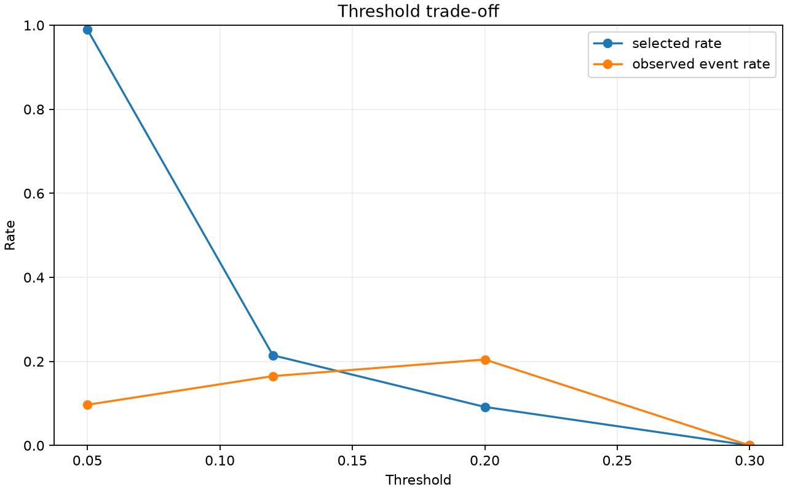
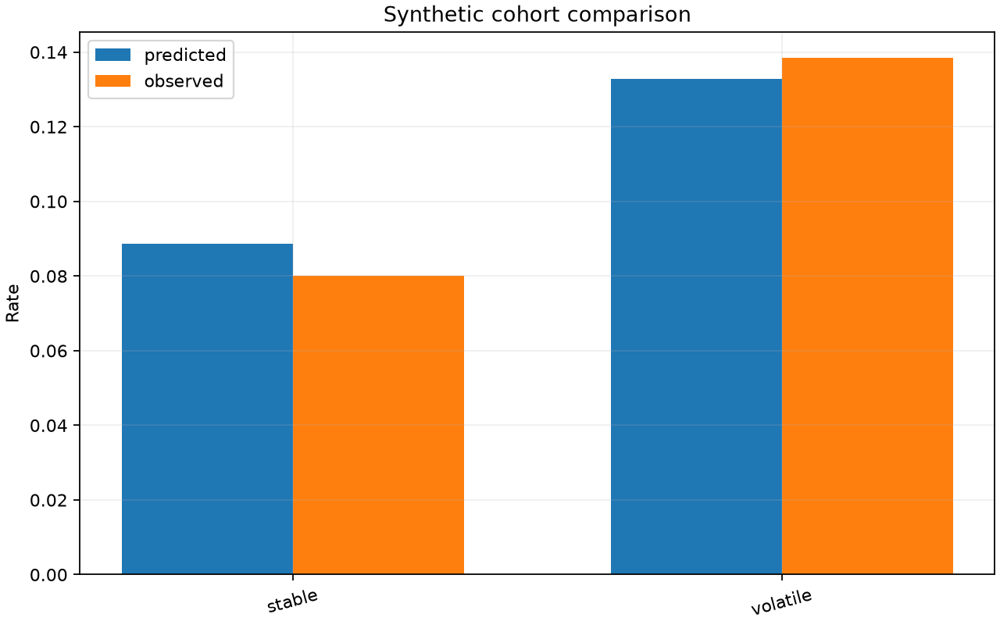
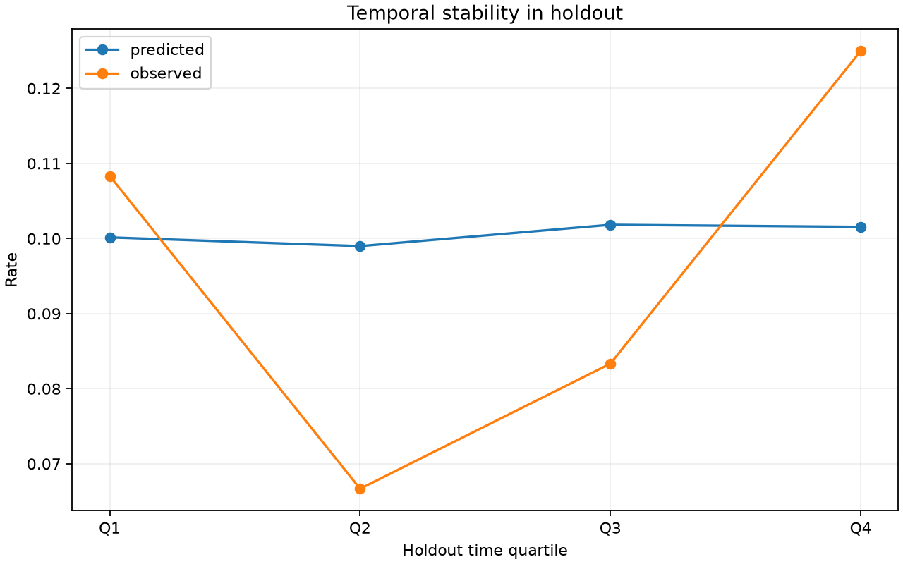
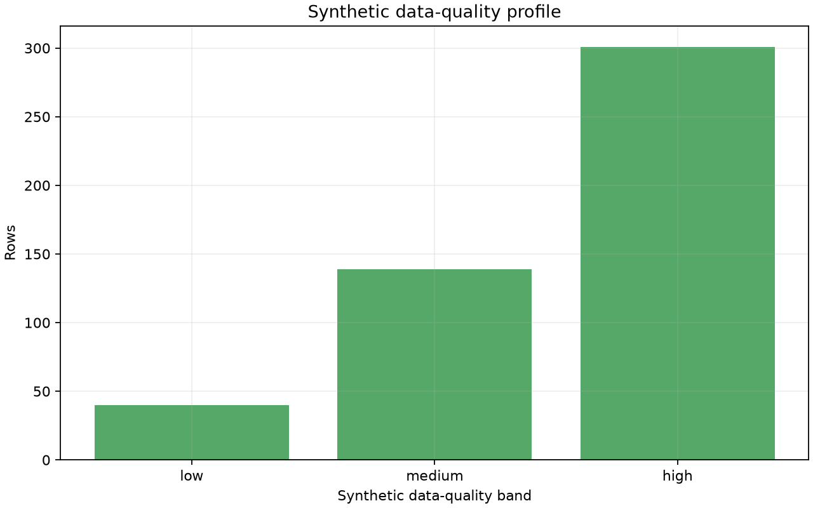
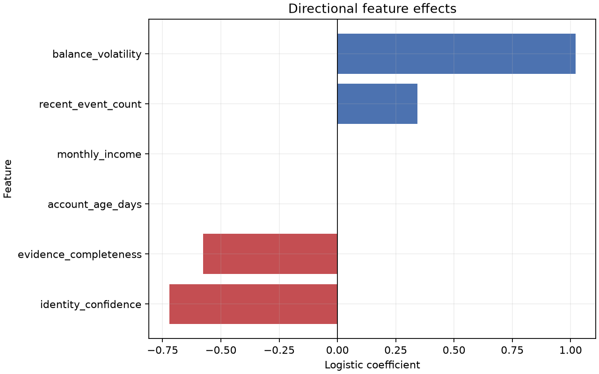

# Open Decisioning Lab: Evaluation Report

> Detailed, reproducible evaluation of a calibrated model on fully synthetic data.

## Executive Summary

This report separates ranking quality, probability quality, policy thresholds, cohort behavior, temporal stability, and feature effects. It is designed as a review artifact for a Data Scientist or ML Engineer, not as evidence of production performance.

| Metric | Value |
| --- | ---: |
| ROC AUC | 0.643358 |
| Average Precision | 0.184151 |
| Brier Score | 0.085043 |
| Holdout Rows | 480 |
| Holdout Event Rate | 0.095833 |

## Methodology

- Data is generated with a fixed seed, temporal drift, seasonality, two artificial cohorts, data-quality bands, and a nonlinear interaction.
- The estimator is trained on the first 60% of time.
- Isotonic calibration uses the next 20%.
- All reported metrics use the final 20% untouched holdout.
- Diagnostic metadata is excluded from model features.
- The model score and policy decision are evaluated as separate layers.

## Model Quality

### ROC Curve



### Precision-Recall Curve



ROC AUC measures ranking quality. Average Precision is more informative when the positive class is relatively uncommon because it focuses on precision-recall behavior.

## Calibration



The Brier score evaluates probabilistic accuracy after calibration. Calibration is important when a score is used as a probability for threshold or cost analysis.

## Threshold Analysis



| Threshold | Selected Rate | Observed Event Rate | Precision | Recall |
| ---: | ---: | ---: | ---: | ---: |
| 0.05 | 0.990 | 0.097 | 0.097 | 1.000 |
| 0.12 | 0.215 | 0.165 | 0.165 | 0.370 |
| 0.20 | 0.092 | 0.205 | 0.205 | 0.196 |
| 0.30 | 0.000 | 0.000 | 0.000 | 0.000 |

Thresholds change operating behavior without retraining the model. This illustrates why model performance and policy design should be reviewed independently.

## Synthetic Cohorts



| Cohort | Rows | Mean Probability | Observed Event Rate | Brier Score |
| --- | ---: | ---: | ---: | ---: |
| stable_synthetic_cohort | 350 | 0.0886 | 0.0800 | 0.0735 |
| volatile_synthetic_cohort | 130 | 0.1329 | 0.1385 | 0.1163 |

These are artificial diagnostic cohorts, not protected groups and not a real-world fairness assessment.

## Temporal Stability



The holdout is split into time quartiles to make temporal drift visible. In a production system this would be extended into rolling monitoring and alerting.

## Data Quality



Evidence completeness is synthetic diagnostic metadata. The policy layer can route incomplete evidence to review instead of treating missingness as a favorable signal.

## Feature Effects



The coefficient chart shows directional effects in the uncalibrated logistic score. These are not causal effects and should not be interpreted as individual explanations without separate stability validation.

## Limitations

- Synthetic distributions do not establish production validity.
- Synthetic cohorts do not constitute fairness certification.
- Production use would require representative data governance, drift monitoring, model registry, rollback, and review of policy costs.
- The model is intentionally small and demonstrates workflow rather than state-of-the-art predictive performance.

## Reproduce

```powershell
python scripts/generate_evaluation_report.py --seed {config.seed} --rows {config.rows}
```
